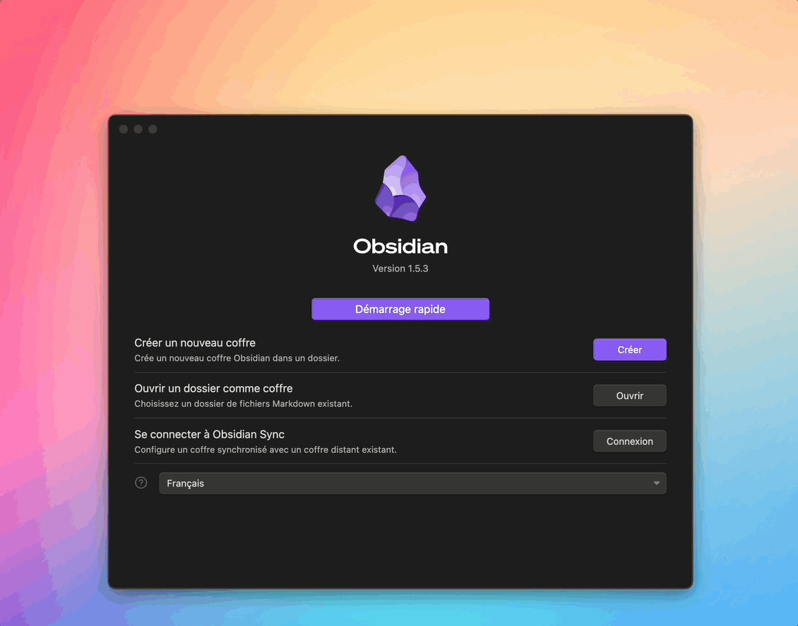
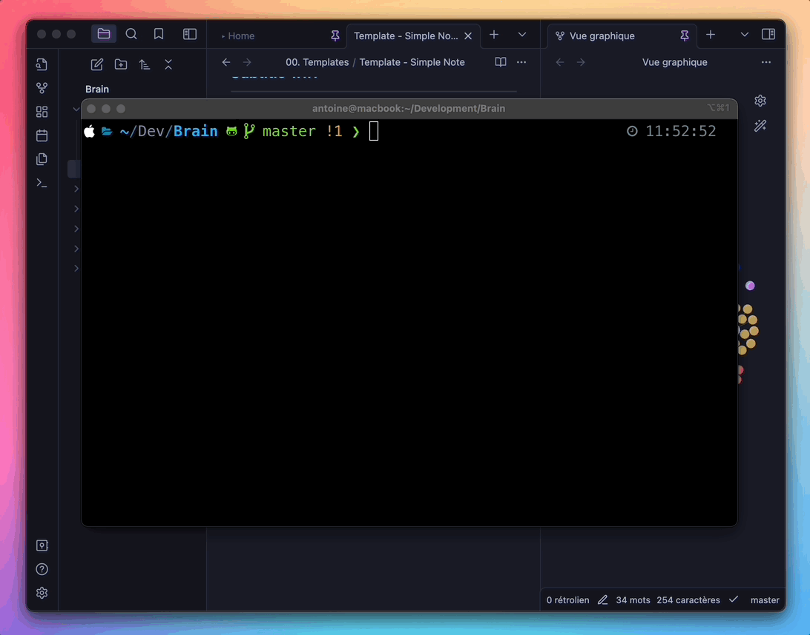

<br>

This repo aims to propose an initialization folder to synchronize its Obsidian vault in GitHub.

# Table of Contents
- [Installation](#installation)
- [Synchronization](#synchronization)

## Installation

1. Download Obsidian packages.
2. Download Git projet before runnning Obsidian.
    ```bash
    git clone https://github.com/shinydisk/ObsidianSync.git
    ```
3. Install & open Obsidian.
4. Click open and select the Git repository you just downloaded :

> You can remove **assets folder** ands **REAMDE file** for clean installation
## Synchronization

Create some notes in your new environment.
Before create the new repository, you just need to run the script ``.obsidiansync`` to sync your Obsidian in your new repository.

1. Open your terminal, go to the directory that corresponds to your Obsidian and type the following commands :
```bash
git remote add origin git@github.com:username/ObsidianSync.git
git branch -M master
git push -u origin master
```

In this example, I show you how to synchronize your Obsidian with Git using the script :


---
<div align="center">
  MIT licensed | Copyright © 2024 Shinydisk, https://abkr.fr
</div>
